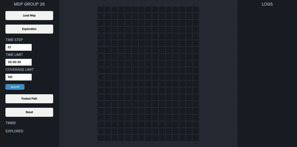
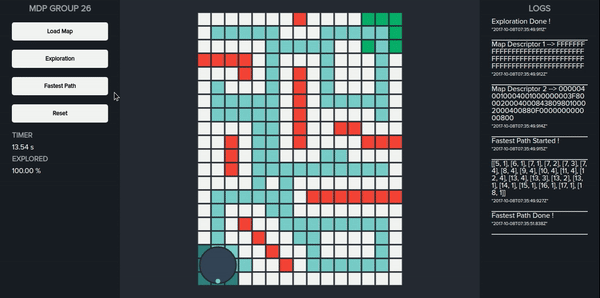

# MDP-Algo

Algorithm for a maze solving robot, the robot first needs to explore the maze and then take the fastest path from the start to goal cell.

## Details
* Uses a modified version of the Right-Wall Hugging algorithm for exploration
  * Added checks for maximum time a cell is visited
  * Multiple block movement during forward motion
  * Exploring left out regions by taking fastest path to nearest unexplored cell
* Uses a modified version of the A* algorithm for Fastest Path
  * Adds a penalty for turning to encourage straight line motion
 
## Usage
* Clone the repository and navigate to the folder
* Run `python server_sim.py` and navigate to `localhost:8888` in a browser

## Exploration Demo

## Fastest Path Demo

